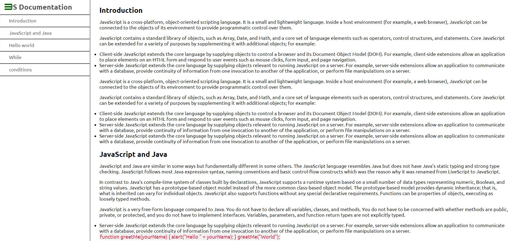

#### Js Documentation (Code-Review)

### Learning objectives

- Apply best practices in HTML code.
- Use semantic HTML tags.
- Use CSS selectors correctly.
- Use CSS box model.
- Perform a code review for yourself on a past project.

### Setup

To get a local copy up and running follow these simple example steps.

- Clone the repository to your computer using git clone [Git Clone Url](https://github.com/abdulrahmanshr75/Code-Review.git)
- Cd into the folder
- Open index.html with live server
- Or you can Fork it instead, and create a pull request to suggest some changes

## Prerequisites

- Setup
- Install
- Run tests
- Deployment

## Built With

- HTML
- CSS

## technology used

- Linters
- VScode
- html & css
- github

## Authors

👤 Abdulrahman Shrshar

- GitHub: [@githubhandle](https://github.com/abdulrahmanshr75)
- LinkedIn: [LinkedIn](https://www.linkedin.com/in/abdulrahman-shrshar-721144161/)

## Acknowledgments

- Hat tip to my coding partners and code reviewer for their contribution

## Show your support

- give a thumb 👍 if you like this project

## Contributing

- Contributions, issues, and feature requests are welcome!

## License

- This project is MIT licensed
